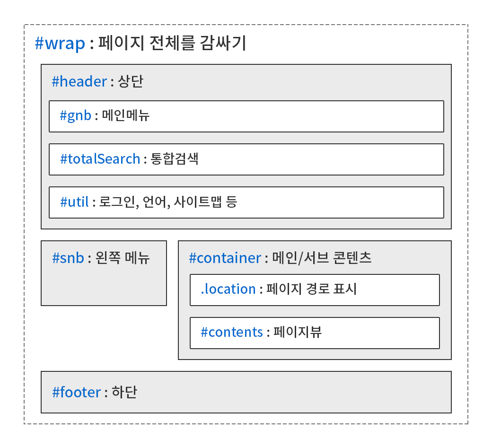
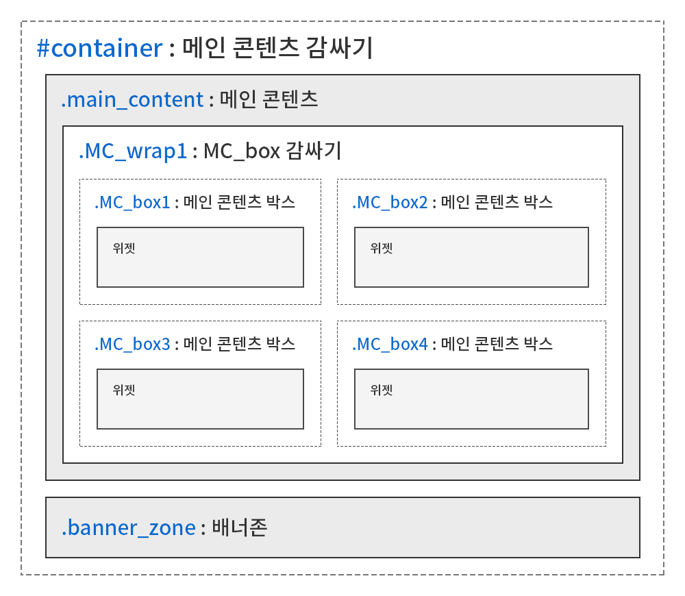

<h2>목차</h2>

- [개요](#개요)
- [개정 이력](#개정-이력)
- [1. 공통 규칙](#1-공통-규칙)
  - [1.1. 작업자 정보 표기](#11-작업자-정보-표기)
  - [1.2. 네이밍](#12-네이밍)
    - [1.2.1. HTML/CSS/JS 파일명](#121-htmlcssjs-파일명)
    - [1.2.2. 이미지 파일명](#122-이미지-파일명)
    - [1.2.3. 기본 HTML 레이아웃 구조](#123-기본-html-레이아웃-구조)
    - [1.2.4. class 표기법](#124-class-표기법)
    - [1.2.5. ID 표기법](#125-id-표기법)
    - [1.2.6. class 네이밍 확장](#126-class-네이밍-확장)
  - [1.3. 크로스브라우징 범위](#13-크로스브라우징-범위)
- [2. HTML 코드 작성 규칙](#2-html-코드-작성-규칙)
  - [2.1. 유효성 오류 없는 HTML 파일](#21-유효성-오류-없는-html-파일)
    - [2.1.1. 자주 검출되는 오류](#211-자주-검출되는-오류)
  - [2.2. 주석 표기](#22-주석-표기)
    - [2.2.1. 개발 적용과 관련된 주석 표기](#221-개발-적용과-관련된-주석-표기)
  - [2.3. 빈 줄](#23-빈-줄)
  - [2.4. 들여쓰기](#24-들여쓰기)
  - [2.5. DTD 및 인코딩](#25-dtd-및-인코딩)
    - [2.5.1. DTD 선언](#251-dtd-선언)
    - [2.5.2. 인코딩 선언](#252-인코딩-선언)
  - [2.6. SEO 대응](#26-seo-대응)
  - [2.7. 속성 선언 순서](#27-속성-선언-순서)
  - [2.8. 특수기호 변환](#28-특수기호-변환)
  - [2.9. section/article 태그 내에 제목 태그 필수 포함](#29-sectionarticle-태그-내에-제목-태그-필수-포함)
- [3. CSS 코드 작성 규칙](#3-css-코드-작성-규칙)
  - [3.1. 유효성 오류 없는 CSS 파일](#31-유효성-오류-없는-css-파일)
    - [3.1.1. 자주 검출되는 오류](#311-자주-검출되는-오류)
  - [3.2. 주석 표기](#32-주석-표기)
  - [3.3. 빈 줄](#33-빈-줄)
  - [3.4. 줄 바꿈](#34-줄-바꿈)
  - [3.5. 들여쓰기](#35-들여쓰기)
  - [3.6. CSS 선언 방식](#36-css-선언-방식)
  - [3.7. 인코딩 선언](#37-인코딩-선언)
  - [3.8. 마지막 속성의 세미콜론 표기](#38-마지막-속성의-세미콜론-표기)
  - [3.9. 속성값 축약](#39-속성값-축약)
  - [3.10. !important 속성 사용 지양](#310-important-속성-사용-지양)
  - [3.11. 특정 class 사용 지양](#311-특정-class-사용-지양)
- [참고 사이트](#참고-사이트)

---

## 개요

본 문서는 케이엘정보통신㈜ (KLIC)의 웹 퍼블리싱 작업자가 소스 코드 작성 시에 따라야 할 표준 규칙을 기술하며, 프로젝트와 유지보수에 투자되는 시간을 최소화하기 위한 통일된 코드 작성법을 제시한다. 모든 작업자는 본 문서의 규칙을 반드시 지켜야 한다.

## 개정 이력

버전|일자|내용|작성자
--- | --- | --- | ---
&nbsp;|2020-12-11|초안 작성|오세현

---

## 1. 공통 규칙

이 단락에서는 공통으로 해당되는 규칙을 기술한다.

### 1.1. 작업자 정보 표기

퍼블리싱 파일(CSS/JS)에 대한 작업자 정보(최초 작성자/수정자)를 표기하여 필요 시 작업자를 빠르게 찾을 수 있도록 한다. 표기 규칙은 다음과 같은 방식을 따르며, 파일 최상단에 표기한다.

CSS 파일의 작업자 정보는 최상단 ```@charset```과 ```@import``` 구문 다음 줄에 표기한다.

```css
@charset "utf-8";

/*-------------------------------------------------
Author : sehyun oh
Create date : 2020. 12. 10.
Edit : hong gil dong, 2020. 12. 11.
-------------------------------------------------*/
```

최초 작성자명(자신의 영문 이름/이니셜)을 ```Author```에, 최초 작성일은 ```Create date```에 표기한다.

타 작업자가 작성한 파일을 전체적으로 수정/추가해야 하는 경우(예를 들어 타 작업자가 서브 레이아웃을 작업한 ```sub.css``` 파일에 자신이 서브 콘텐츠를 작업해야 할 때), 마지막 단락에 ```Edit```를 추가, 작업자명과 날짜를 표기한다.

파일의 특정 부분을 수정했을 때는 다음과 같이 **&lt;날짜 작업자명, 내용&gt;** 순서로 표기한다.

```css
/* 2020.12.10. sehyun oh, IE 버그로 틀어지는 현상 수정 */
.gnb {display: block; width: 100%;}
```

### 1.2. 네이밍

#### 1.2.1. HTML/CSS/JS 파일명

다음과 같은 파일명 표기 규칙을 준수한다.

**HTML**

파일명|용도
--- | ---
index.html|메인
guide.html|서브 레이아웃 및 스타일가이드
sub.html|스타일가이드 페이지 없이 서브 레이아웃만 있는 경우
sub0104_인사말.html|서브콘텐츠 파일명 예시로, ```첫 번째 1depth → 네 번째 2depth → 페이지명```의 순서로 표기
sub0104_인사말(tab01_연혁).html|위의 예시에서 네 번째 2depth의 페이지 이동 탭으로 나뉜 페이지의 경우, ```tab``` 번호로 구분

**CSS**

파일명|용도
--- | ---
basic.css|공통 요소
fonts.css|폰트
layout.css|공통 레이아웃
main.css|메인 공통 콘텐츠
main_widget.css|템플릿 메인 위젯
main_cnt.css|템플릿 메인 콘텐츠
con_com.css|서브 콘텐츠 공통 요소
board.css|게시판/로그인 폼
sub.css|서브 레이아웃 및 서브 공통 콘텐츠
sub_cnt.css|템플릿 서브 콘텐츠
popup.css|새창 팝업

**JS**

파일명|용도
--- | ---
common.js|공통 요소
layout.js|공통 레이아웃
main.js|메인 콘텐츠
con_com.js|서브 콘텐츠 공통 요소
board.js|게시판/로그인 폼
sub.js|서브 레이아웃 및 서브 콘텐츠

#### 1.2.2. 이미지 파일명

**A. 서브 콘텐츠**

이미지 파일명 표기법은 아래 표기법을 준수한다.

**&lt;페이지명 줄임말_이미지 의미&gt;** 표기법

```html
<!-- 인사말(greeting) 페이지 이미지명 예시 -->
grt_img.png
grt_ico.png

<!-- 조직도(organization) 페이지 이미지명 예시 -->
org_img.png
org_line.png
```

다음과 같은 파일명 표기법은 지양한다.

```html
<!-- sub0104.html 파일에 들어가는 이미지 예시로, 추후 depth 변경으로 sub0105가 될 수 있으므로 이런 방식은 지양. -->
img0104_01.png
```

**B. 그 외**

이미지 파일명은 **&lt;형태_의미_상태&gt;** 순서로 표기하며, 숫자로 시작할 수 없다.

```html
btn_more.png
btn_close_on.png

<!-- 동일한 이름의 경우 숫자로 구분해준다. -->
btn_search_01.png
btn_search_02.png
```

그리고 이미지 확장자는 반드시 소문자로 저장한다.

```
btn_more.PNG (X)
btn_more.png (O)
```

#### 1.2.3. 기본 HTML 레이아웃 구조

다음 그림은 기본 HTML 레이아웃을 나타낸 것이다.



다음 그림은 기본 메인 템플릿 레이아웃을 나타낸 것이다.



우선 ```.MC_box```의 사용 목적은 **위젯의 위치**를 잡아주고, 위젯을 담고 있는 **```MC_box```의 높이값을 고정**시켜서, 위젯이 없어도 **레이아웃이 틀어지지 않게** 하는 게 주목적이다.

그리고 ```.MC_wrap```은 디자인 상 ```MC_box```를 감싸야 할 경우 사용한다.

```.MC_wrap```과 ```.MC_box```는 개수에 제한이 없고, 한 개밖에 없어도 숫자 ```1```을 표기하며, 디자인 상 ```.MC_box```를 감쌀 필요 없을 경우 ```.MC_wrap```을 생략할 수 있다.

**위젯 class 네이밍 시 유의사항**

위젯의 class는 ```.MC_box``` class명과 분리되어야 한다.

```html
<div class="notice"></div> (O)
<div class="MC_box1_notice"></div> (X)
```

신규 HTML 파일을 작성할 때 본 레이아웃 구조 및 class를 참고하되 가장 최근에 완료된 프로젝트의 산출물을 기준으로 하여 항상 최신의 코드 품질을 유지한다.

#### 1.2.4. class 표기법

class의 단어와 단어를 이을 때 ```_``` 기호를 사용한다.

```css
.chart_wrap {}
```

#### 1.2.5. ID 표기법

동일한 ID는 한 페이지에서 한 번만 사용할 수 있으며, 레이아웃과 관련된 요소 또는 JS 작성을 위해서만 사용하고 ID의 단어와 단어를 이을 때 ```_``` 기호를 사용한다.

```css
#header {}

#visual_slider {}
```

#### 1.2.6. class 네이밍 확장

디자인 속성 추가/변경을 위해 class를 확장해서 사용하려는 경우, 다음과 같은 표기법을 따른다.

**A. 종속 확장 class**

기본형 class에 종속되어 여백, 색깔, 행간 등의 몇 가지 속성을 부여하고자 할 때 사용하는 class. 다음은 ```chart_wrap``` class 확장 예시이다.

```html
<div class="chart_wrap type1"></div>
<div class="chart_wrap type2"></div>

<div class="chart_wrap typeA"></div>
<div class="chart_wrap typeB"></div>
```

**B. 독립 확장 class**

기본형 class의 변형이 type으로 분류할 만큼 클 경우 사용하는 class로, 작성 예시는 다음과 같다.

```html
<div class="chart_wrap1"></div>
<div class="chart_wrap2"></div>

<div class="chart_wrapA"></div>
<div class="chart_wrapB"></div>
```

### 1.3. 크로스브라우징 범위

다음 목록은 모든 프로젝트에 적용되는 기본 크로스브라우징 범위이며, 프로젝트 별로 범위가 가감될 수 있다.

- 크롬
- IE 9 ~
- 엣지
- 파이어폭스
- 사파리

---

## 2. HTML 코드 작성 규칙

이 단락에서는 HTML 코드 작성에 대한 규칙을 기술한다.

### 2.1. 유효성 오류 없는 HTML 파일

모든 HTML 파일의 최종본은 [W3C Validatation](https://validator.w3.org/unicorn/?ucn_lang=ko)를 이용한 유효성 검사를 통과해야 한다. 검사 결과에서 수정하지 않아도 되는 경고/오류 사항이 있는 경우 무시할 수 있다. 로컬 환경에서 검사하려면 [이곳](https://validator.w3.org/nu/)을 이용한다.

HTML 5 DTD 선언 시 다음 오류 내용은 허용한다.

- ```<iframe>``` 태그의 frameborder, marginwidth, marginheight, scrolling 속성

#### 2.1.1. 자주 검출되는 오류

다음은 KLIC 퍼블리싱 산출물에서 자주 검출되는 오류 목록이다. 개발이 완료된 후에 오류가 발생하는 경우가 더 많으니 유의한다.

오류메시지|방안
--- | ---
Duplicate ID ```gnb```.| 한 페이지에서 동일한 ID값(예 : gnb)이 중복되어 오류가 발생하므로 동일한 ID는 한 페이지에서 중복 사용되면 안 된다.
Duplicate attribute ```class```.|```<div class="" class=""></div>``` 예시처럼 HTML의 개별 요소에 같은 속성(예 : class)이 중복 선언되어 발생하는 오류로, 하나만 선언하도록 한다.
No space between attributes.|HTML의 개별 요소에 선언한 속성 간 띄어쓰기가 누락되어 발생하는 오류. `````` img 태그의 src 속성과 alt 속성 사이에 띄어쓰기로 구분되어 있지 않다.
An img element must have an alt attribute, except under certain conditions. For details, consult guidance on providing text alternatives for images.|img 태그에 alt 속성이 누락되어 발생하는 오류. `````` 이렇게 alt에 쓸 내용이 없다고 해서 alt 속성을 누락시키면 안 되고, `````` 반드시 빈 alt 값을 선언해야 한다.
The value of the for attribute of the label element must be the ID of a non-hidden form control.|label 태그의 for 속성값과 매칭되는 ID값을 가진 요소가 없어서 발생하는 오류. ```<label for="element"></label> <input type="text" id="element">``` 예시처럼 반드시 label과 상호작용할 요소에 for 값과 매칭되는 ID 값을 선언해주어야 한다.
td start tag in table body.|table 태그의 td 또는 th 태그의 부모 요소인 tr 태그가 누락되어 발생하는 오류.
Table cell spans past the end of its row group established by a tbody element; clipped to the end of the row group.|table 태그 th 또는 td 태그의 rowspan/colspan 수치가 맞지 않아 발생하는 오류. 수치가 맞지 않으면 틀어져 보이므로 반드시 수치를 확인한다.
Bad value ```첨부 파일.zip``` for attribute href on element a: Illegal character in path segment: space is not allowed.|```<a href="첨부 파일.zip">파일 다운로드</a>``` a 태그의 href 속성값에 공백이 포함되어 발생하는 오류. ```<a href="첨부_파일.zip">파일 다운로드</a>``` 예시처럼 공백을 ```_``` 기호 등으로 바꿔서 오류를 방지한다.
A document must not include both a meta element with an http-equiv attribute whose value is content-type, and a meta element with a charset attribute.|HTML 파일의 인코딩 정보 선언을 위한 meta 태그 ```<meta charset="utf-8">```와 ```<meta http-equiv="Content-Type" content="text/html; charset=utf-8" />```가 중복되어 발생하는 오류로, HTML 5를 사용할 땐 전자만 있으면 되고 HTML 4.01은 후자만 있으면 된다.

### 2.2. 주석 표기

HTML 주석은 다음과 같이 표기하며, 주석 기호와 내용 사이에 한 칸의 공백을 둔다.

```html
<!-- 내용 -->
```

HTML 주석의 시작/종료 주석은 다음과 같이 표기하며, 종료 주석의 슬래시 기호와 내용 사이에는 공백을 두지 않는다.

```html
<!-- header -->
<header id="header"></header>
<!-- //header -->
```

#### 2.2.1. 개발 적용과 관련된 주석 표기

개발 적용과 관련된 주석은 다음과 같이 [D]라는 말머리를 사용하여 담당 개발자가 반드시 확인할 수 있도록 한다. 종료 주석은 표기하지 않는다.

퍼블리싱 파일을 담당 개발자에게 전달 시, 메모장 파일 등에 **[D]라는 말머리가 붙은 주석이 개발단에서 처리가 되어야하는 부분**임을 명시하여 함께 전달하도록 한다.

```html
<ul>
    <!-- [D] 내용 없을 경우 no_Data 클래스 추가 -->
    <li class="no_Data">데이터가 없습니다.</li>
</ul>
```

### 2.3. 빈 줄

각 객체의 그룹(box/container의 개념)을 구분하기 위하여 코드 그룹 간 1줄씩 빈 줄을 넣을 수 있다. 빈 줄의 간격은 1줄을 초과하지 않는다.

**빈 줄이 없는 상태**

```html
<head>
내용...
</head>
<body>
내용...
</body>
```

**빈 줄 삽입된 상태**

```html
<head>
내용...
</head>

<body>
내용...
</body>
```

### 2.4. 들여쓰기

HTML 코드에 대한 들여쓰기는 Tab(탭)키를 사용한 4칸 들여쓰기로 통일한다.

**잘못된 예 : Space bar(스페이스 바)키를 사용한 2칸 들여쓰기는 들여쓰기의 공백이 상대적으로 적어서, 가독성이 저하될 우려가 있다.**

```html
<div>
  <p></p> <!-- Space bar(스페이스 바)키를 사용한 2칸 들여쓰기 -->
</div>
```

**올바른 예**

```html
<div>
    <p></p> <!-- Tab(탭)키를 사용한 4칸 들여쓰기 -->
</div>
```

### 2.5. DTD 및 인코딩

#### 2.5.1. DTD 선언

HTML 파일은 반드시 DTD(문서 형식 선언)을 파일의 최상단에 선언한다. 신규 HTML 파일을 작성할 때는 HTML 5를 사용하며 작성 예는 다음과 같다.

```html
<!DOCTYPE html>
```

HTML 4.01, XHTML 1.0, XHTML 1.1, HTML 5 각각 선언문이 다르므로 확인해야 하며 중복 선언하지 않는다.

#### 2.5.2. 인코딩 선언

HTML 파일은 반드시 인코딩 정보를 선언한다. 기본 인코딩은 utf-8을 원칙으로 하며 작성 예는 다음과 같다.

```html
<meta charset="utf-8">
```

HTML 4.01 DTD 사용 예시는 다음과 같고, HTML 타 버전의 것과 중복되지 않게 선언한다.

```html
<meta http-equiv="Content-Type" content="text/html; charset=utf-8" />
```

파일을 저장할 때는 반드시 선언한 인코딩과 동일한 인코딩을 선택한다.

DTD 및 인코딩을 선언한 예시는 다음과 같다.

```html
<!DOCTYPE html>
<html lang="ko">
<head>
    <meta charset="utf-8">
    ...
</head>
<body>
    
</body>
</html>
```

### 2.6. SEO 대응

검색엔진최적화(SEO)는 퍼블리싱단에서 해결되어야 할 기초적인 요소이며, 작성 예시는 다음과 같다.

```html
<head>
    <title>전라남도교육청</title>
    <meta property="og:type" content="website">
    <meta property="og:title" content="전라남도교육청"> <!-- 사이트명 -->
    <meta property="og:description" content="혁신 교육을 실천하는 전라남도교육청"> <!-- 사이트에 대한 설명 -->
    <meta property="og:image" content="./images/layout/logo.png"> <!-- 사이트 로고 이미지 경로 -->
    <meta property="og:url" content=""> <!-- [D] content 값에 운영서버의 메인페이지 URL 표기 부탁드립니다. -->
    ...
</head>
```

마지막 ```property="og:url"``` 속성을 가진 ```<meta>``` 태그의 content 속성값에는 운영서버의 메인페이지 URL(위 예시의 경우 ```http://www.jne.go.kr/```)이 들어간다.

퍼블리셔 측에서는 해당 URL을 미리 알 수 없으므로 퍼블리싱할 때 표기하지 않고, 주석을 통해 담당 개발자에게 적용을 요청한다.

### 2.7. 속성 선언 순서

HTML의 개별 요소에 속성 선언 시 ```class```, ```style``` 속성을 마지막에 선언한다.

```html
<a href="" title="새창" target="_blank" id="btn" class="btn" style=""></a>
```

### 2.8. 특수기호 변환

특수기호는 Entity 코드로 변환한다. 그렇지 않으면 브라우저가 이를 시작/종료 태그나 속성으로 해석할 수 있다. 다음은 사용 빈도가 높은 특수기호 목록이다.

특수기호|Entity
--- | ---
```&```|```&amp;```
```·```|```&middot;```
```<```|```&lt;```
```>```|```&gt;```
```←```|```&larr;```
```↑```|```&uarr;```
```→```|```&rarr;```
```↓```|```&darr;```
```↔```|```&harr;```

[이곳](https://www.w3schools.com/charsets/ref_html_entities_4.asp)에서 Entity 코드를 확인할 수 있다.


### 2.9. section/article 태그 내에 제목 태그 필수 포함

```<section>``` 태그 또는 ```<article>``` 태그는 HTML 문서의 독립적인 구획을 나타내는 데 사용한다.

사용 시 반드시 다음과 같이 제목 태그(h1 ~ h6)를 포함시켜 웹 접근성 측면에서 각 구획을 식별할 수 있게 해야 한다.

```html
<section>
    <h2>공지사항</h2>
</section>
```

디자인 시안에 제목 태그가 없는 경우에는 다음과 같은 class 사용을 통한 숨김 처리를 하여, 스크린 리더에서 인식이 가능하도록 한다.

```html
<section>
    <h2 class="sr-only">공지사항</h2>
</section>
```
---

## 3. CSS 코드 작성 규칙

이 단락에서는 CSS 코드 작성에 대한 규칙을 기술한다.

### 3.1. 유효성 오류 없는 CSS 파일

모든 CSS 파일의 최종본은 [W3C Validatation](https://validator.w3.org/unicorn/?ucn_lang=ko)를 이용한 유효성 검사를 통과해야 한다. 검사 결과에서 수정하지 않아도 되는 경고/오류 사항이 있는 경우 무시할 수 있다. 로컬 환경에서 검사하려면 [이곳](https://validator.w3.org/nu/)을 이용한다.

#### 3.1.1. 자주 검출되는 오류

다음은 KLIC 퍼블리싱 산출물에서 자주 검출되는 오류 목록이다.

오류메시지|방안
--- | ---
CSS: Parse Error.|속성 선언 시 콜론 ```:``` 누락 또는 중괄호 ```{}``` 누락되어 발생하는 오류. ```td {padding; 0.3rem 0.5rem; border-bottom: 1px solid #ccc;``` 예시를 보면 ```padding;```에 콜론 대신 세미콜론이 있고, 마지막 속성 선언 후 중괄호로 닫지 않았다.
```padding```: Missing a semicolon before the property name ```border-bottom```.|속성값 사이에 세미콜론 ```;```이 누락되어 발생하는 오류. ```td {padding:0.3rem 0.5rem border-bottom:1px solid #ccc;}``` 예시를 보면 ```padding:0.3rem 0.5rem```과 ```border-bottom:1px solid #ccc``` 사이에 세미콜론이 누락되어 있다.

### 3.2. 주석 표기

CSS 주석은 다음과 같이 표기하며, 주석 기호와 내용 사이에 한 칸의 공백을 둔다.

```css
/* 내용 */
```

각 객체의 하위 그룹에 대한 주석은 다음과 같이 ```*``` 기호의 개수로 구분을 지어준다.

```css
/* gnb */
.gnb {}

/** 2차메뉴 **/
.gnb .depth2 {}

/*** 3차메뉴 ***/
.gnb .depth3 {}
```

### 3.3. 빈 줄

각 객체의 그룹(box/container의 개념)을 구분하기 위하여 코드 그룹 간 1줄씩 빈 줄을 넣을 수 있다. 빈 줄의 간격은 1줄을 초과하지 않는다.

**빈 줄이 없는 상태**

```css
/* header */
#header {}
#header .logo {}
/* 메인메뉴 */
#mainMenu {}
#mainMenu .gnb {}
```

**빈 줄 삽입된 상태**

```css
/* header */
#header {}
#header .logo {}

/* 메인메뉴 */
#mainMenu {}
#mainMenu .gnb {}
```

### 3.4. 줄 바꿈

가독성을 위해 줄 바꿈을 하지 않고 한 줄에 작성한다.

**잘못된 예 : 줄 바꿈으로 인해 길어져서 파악에 불편하고, 파일 용량에도 영향을 미칠 수 있음**

```css
.gnb {
    display: block;
    width: 100%;
}

.gnb .depth2 {
    width: 100%;
}
```
**올바른 예 : 파악하기 쉽게 한 줄에 작성**

```css
.gnb {display: block; width: 100%;}
.gnb .depth2 {width: 100%;}
```

그리고 쉼표로 구분되는 선택자 간 공백은 줄 바꿈을 해준다.

```css
.gnb,
.gnb .depth2 {}
```

### 3.5. 들여쓰기

CSS 코드를 작성할 때는 들여쓰기를 하지 않는다. 단, 선택자와 중괄호 ```{}```가 중첩되는 경우 또는 SCSS(Sass) 사용 시 들여쓰기를 할 수 있다.

**잘못된 예 : 가독성 저하됨**

```css
.gnb {}
  .gnb .depth2 {}
    .gnb .depth3 {}

@media print { #header {display: none;} }
```

**올바른 예 : 영역을 구분하려면 줄 바꿈/주석을 사용한다.**

```css
/* gnb */
.gnb {}

/** 2차메뉴 **/
.gnb .depth2 {}

/*** 3차메뉴 ***/
.gnb .depth3 {}

@media print {
    #header {display: none;}
}
```

### 3.6. CSS 선언 방식

CSS 선언 방식은 네 가지로 분류하며, 용도에 맞게 사용하되 **A. 외부 스타일시트** 방식과 **D. @import** 방식을 기본으로 사용한다.

- **A. 외부 스타일시트**

  CSS를 선언하는 가장 기본적인 방식으로, CSS 파일이 별도로 존재하는 형태이다. link 태그를 통해 HTML과 CSS를 연결하며, 작성 예시는 다음과 같다.
  
  ```html
  <link rel="stylesheet" href="./css/layout.css">
  ```

- **B. 내부 스타일시트**

  HTML 파일의 head 태그 안에 스타일을 선언하는 방식으로, 꼭 필요한 경우가 아니면 사용을 지양한다. 작성 예시는 다음과 같다.

  ```html
  <head>
      ...
      <style>
          .class1 {top: 0; left: 1rem;}
      </style>
  </head>
  ```

- **C. 인라인 스타일**

  HTML의 개별 요소에 style 속성을 이용하여 스타일을 선언하는 방식으로, 속성 값이 동적으로 변경되어야 하는 경우 사용하며, 위의 내부 스타일시트 방식과 마찬가지로 사용을 지양한다. 작성 예시는 다음과 같다.

  ```html
  <div style="top: 0; left: 1rem;">
  
  </div>
  ```

- **D. @import**

  CSS 파일에서 다른 CSS 파일을 불러올 때 사용하는 방식으로, ```@charset``` 선언을 제외하고 모든 다른 종류의 규칙보다 최상위에 선언해야 한다. 작성 예시는 다음과 같다.

  ```css
  @import url("./layout.css");
  ```

  다른 CSS 파일에서 ```layout.css``` 파일을 불러왔으므로 동일한 파일을 외부 스타일시트로 불러올 필요가 없다.

  다수의 CSS 파일을 import할 경우 ```@charset``` 선언은 최상위 CSS 파일에 한 번만 선언한다.

### 3.7. 인코딩 선언

주석, 폰트 이름 등이 영문이 아닐 때 이를 브라우저에서 바르게 표현하고, HTML에서 불러온 스타일을 제대로 렌더링하기 위해 반드시 CSS 인코딩을 선언해야 한다. HTML과 동일한 인코딩을 CSS 파일 모든 다른 규칙보다 최상단에 선언하며, 작성 예는 다음과 같다.

```css
@charset "utf-8";
```

파일을 저장할 때는 반드시 선언한 인코딩과 동일한 인코딩을 선택한다.

### 3.8. 마지막 속성의 세미콜론 표기

다른 작업자가 이어서 작성하기 편하게 마지막 속성의 세미콜론을 반드시 표기한다.

**잘못된 예**

```css
.gnb {display: block; width: 100%}
```

**올바른 예**

```css
.gnb {display: block; width: 100%;}
```

### 3.9. 속성값 축약

CSS 가독성 향상을 위해 다음과 같이 속성값을 축약한다.

**축약 전**

```css
.class {
  top: 0px;
  margin: 2rem 2rem 2rem 2rem;
  padding: 2rem 3rem 2rem 3rem;
  color: #ffffff;
}
```

**축약 후**

```css
.class {
  top: 0; /* 속성값이 0일 경우 단위를 표기하지 않는다. */
  margin: 2rem;
  padding: 2rem 3rem; /* 상하좌우의 속성값이 동일하면 축약한다. */
  color: #fff;
}
```

소수점 단위에서 0이 앞에 위치하는 경우에는 가독성을 위해 0을 표기한다.

```css
.class {font-size: .9rem } (X)
.class {font-size: 0.9rem } (O)
```

### 3.10. !important 속성 사용 지양

```!important``` 속성은 자연스러운 스타일 우선순위를 무시하고 가장 높은 우선순위를 가지게 한다. 이로 인해 우선순위가 꼬여서 수정 및 유지보수 작업에 애로사항이 있을 수 있으니 절대 사용하지 않도록 하며, 스타일 우선순위 규칙에 맞게 CSS 코드를 작성한다.

다음과 같은 예외사항이 존재할 수 있다.

- ```<col>``` 태그의 style 속성에 선언된 ```width```값을 조절해야 할 경우 ```!important``` 속성 사용 가능
- JS에서 정의된 스타일은 CSS 파일보다 높은 우선순위를 가지므로 ```!important``` 속성으로 조정 가능

**참고**

- [CSS 적용 우선순위](https://opentutorials.org/module/484/4149) - opentutorials.org

### 3.11. 특정 class 사용 지양

다음과 같은 class 사용을 지양한다.

```html
<h3 class="tit1 mgt30"><h3>

<div class="box_st1 mgt10"></div>
```

```css
.mgt30 {margin-top: 1.5rem;}
.mgt10 {margin-top: 0.5rem;}
```

```width``` 또는 ```margin``` 등의 속성값을 위와 같은 class에 정의하고 사용하면, 추후 수정이 필요할 경우 해당 class가 사용된 수많은 페이지에 가서 일일이 수정/삭제를 해야 하는 상황이 발생할 수 있다.

다음과 같이 HTML의 개별 요소에 class를 사용하지 않고 CSS 파일에서 스타일을 정의하는 방식을 사용한다.

```html
<h3 class="tit1"><h3>

<div class="box_st1"></div>
```

```css
.tit1 {margin-top: 1.5rem;}

.tit1 + .box_st1 {margin-top: 0.5rem;}
```

이 방식으로 처리가 안 되는 예외적인 상황에만 해당 class를 사용하고, 사용 시 충분한 이유를 주석에 표기하여 다른 작업자가 파악하는 데 문제 없도록 한다.

---

## 참고 사이트

- [NHN 코딩 컨벤션](https://nuli.navercorp.com/data/convention/NHN_Coding_Conventions_for_Markup_Languages.pdf)
- [KLIC 퍼블리싱 스타일가이드](https://klic.co.kr/design2021/)
