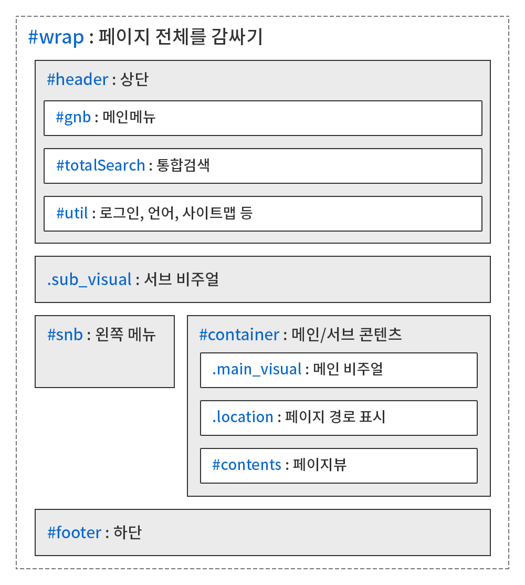
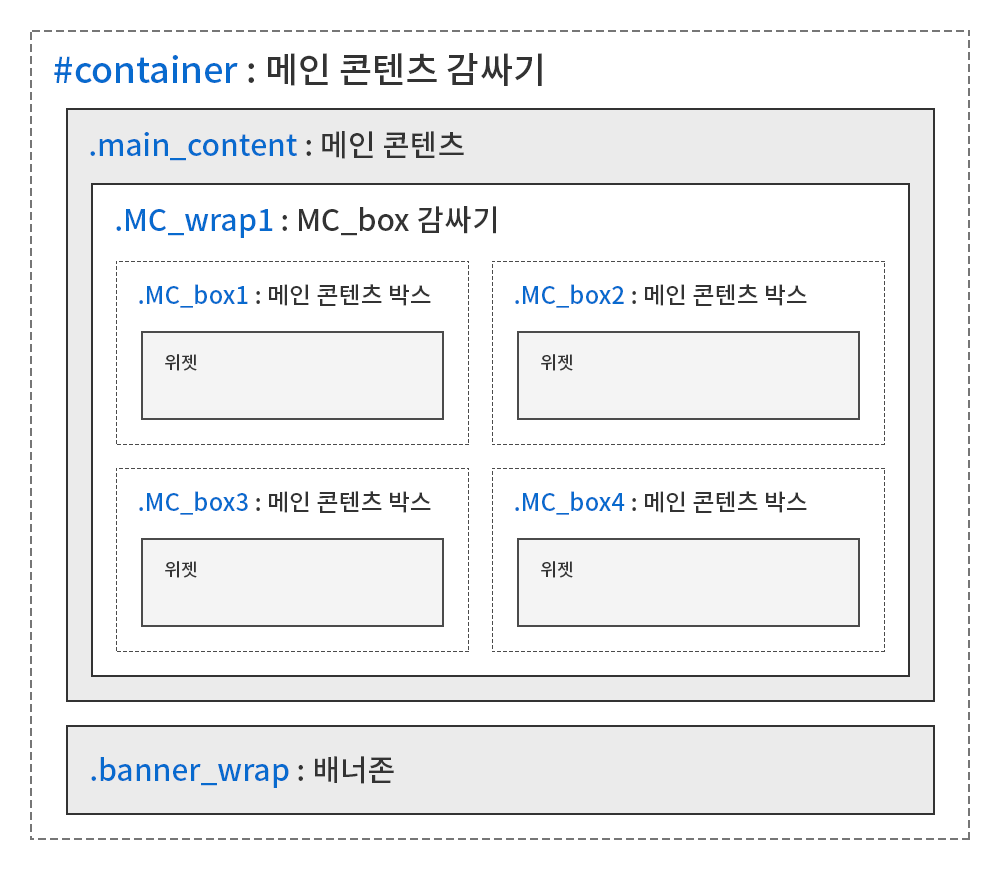

<h1>KLIC 마크업 가이드</h1>

<h2>목차</h2>

- [개요](#개요)
- [개정 이력](#개정-이력)
- [1. 공통 규칙](#1-공통-규칙)
  - [1.1. 작업자 표기](#11-작업자-표기)
  - [1.2. 네이밍](#12-네이밍)
    - [1.2.1. HTML/CSS/JS 파일명](#121-htmlcssjs-파일명)
    - [1.2.2. 이미지 파일명](#122-이미지-파일명)
    - [1.2.3. 기본 HTML 레이아웃 구조](#123-기본-html-레이아웃-구조)
    - [1.2.4. ID 표기법](#124-id-표기법)
    - [1.2.5. 커스텀 클래스 표기법](#125-커스텀-클래스-표기법)
  - [1.3. 크로스브라우징 범위](#13-크로스브라우징-범위)
- [2. HTML 코드 작성 규칙](#2-html-코드-작성-규칙)
  - [2.1. 유효성 오류 없는 HTML 파일](#21-유효성-오류-없는-html-파일)
  - [2.2. 주석 표기](#22-주석-표기)
    - [2.2.1. 개발 적용과 관련된 주석 표기](#221-개발-적용과-관련된-주석-표기)
  - [2.3. 들여쓰기](#23-들여쓰기)
  - [2.4. 속성 선언 순서](#24-속성-선언-순서)
  - [2.5. 특수기호 변환](#25-특수기호-변환)
  - [2.6. 순서에 맞는 Heading 태그 사용](#26-순서에-맞는-heading-태그-사용)
- [3. CSS 코드 작성 규칙](#3-css-코드-작성-규칙)
  - [3.1. 유효성 오류 없는 CSS 파일](#31-유효성-오류-없는-css-파일)
  - [3.2. 주석 표기](#32-주석-표기)
    - [3.2.1. 특정 요소 그룹핑을 위한 주석 표기](#321-특정-요소-그룹핑을-위한-주석-표기)
  - [3.3. 의미 있는 요소들 간의 공백](#33-의미-있는-요소들-간의-공백)
  - [3.4. 중괄호/콜론/세미콜론 간의 공백](#34-중괄호콜론세미콜론-간의-공백)
  - [3.5. 줄바꿈](#35-줄바꿈)
  - [3.6. 들여쓰기](#36-들여쓰기)
  - [3.7. 마지막 속성의 세미콜론 표기](#37-마지막-속성의-세미콜론-표기)
  - [3.8. 단위 변환](#38-단위-변환)
  - [3.9. 통일된 공통 클래스 사용](#39-통일된-공통-클래스-사용)
  - [3.10. 태그 선택자 사용 지양](#310-태그-선택자-사용-지양)
  - [3.11. 속성값 축약](#311-속성값-축약)
  - [3.12. z-index 허용 선언값](#312-z-index-허용-선언값)
  - [3.13. !important 속성 사용 금지](#313-important-속성-사용-금지)
- [4. JS 코드 작성 규칙](#4-js-코드-작성-규칙)
  - [4.1. 주석 표기](#41-주석-표기)
  - [4.2. 들여쓰기](#42-들여쓰기)
- [참고 사이트](#참고-사이트)
    
---

## 개요

본 문서는 케이엘정보통신㈜의 웹 퍼블리싱 작업자가 소스 코드 작성 시에 따라야 할 통일된 규칙을 기술하며, 프로젝트와 유지보수에 투자되는 시간을 최소화하기 위한 통일된 코드 작성법을 제시한다. 웹 퍼블리싱 작업자는 본 문서의 규칙을 반드시 지켜야 한다.

본 문서가 최신의 내용으로 유지되도록 관리하는 책임은 작성담당자 및 회사에게 있고, 내용의 정정/개선 요구를 작성담당자에게 요청할 수 있으며, 담당자는 요청 내용을 검토하여 본 문서를 개정할 수 있다.

## 개정 이력

버전|일자|내용|작성자
--- | --- | --- | ---
0.1|2020-11-21|초안 작성|오세현

---

## 1. 공통 규칙

이 단락에서는 공통으로 해당되는 규칙을 기술한다.

### 1.1. 작업자 표기

퍼블리싱 산출물(CSS/JS)에 대한 최초 작성자/수정자를 표기하는 규칙은 아래와 같은 방식을 따르며, 산출물 최상단 ```@charset "utf-8";``` 선언이나 ```@import``` 선언 다음 줄에 표기한다.

```css
@charset "utf-8";

/*-------------------------------------------------
Author : sehyun oh
Create date : 2020. 12. 10.
Edit : hong gil dong, 2020. 12. 11.
-------------------------------------------------*/
```

최초 작성자명을 Author에, 최초 작성일은 Create date에 표기한다. 다른 이가 작성한 파일을 프로젝트 폴더에 복사 후 수정이 발생한 경우 마지막 단락에 Edit를 추가, 작업자명과 날짜를 표기한다.

작업자명은 영문만 허용하며, 풀네임/이니셜 등 제한을 두지 않으나 누구나 알아볼 수 있게 직관적으로 작성해야 한다.

산출물의 특정 부분을 수정했을 때는, 아래와 같이 **날짜 작업자명, 내용** 순서로 표기한다.

```css
.gnb { display: block; width: 100%; } /* 2020.12.10. sehyun oh, 이러저러한 문제로 틀어지는 현상 수정 */
```

### 1.2. 네이밍

#### 1.2.1. HTML/CSS/JS 파일명

다음과 같은 파일명 표기 규칙을 준수한다.

**HTML**

파일명|용도
--- | ---
index.html|메인
guide.html|서브 레이아웃 및 스타일가이드
sub.html|스타일가이드 페이지 없이 서브 레이아웃만 있는 경우

**CSS**

파일명|용도
--- | ---
basic.css|공통 요소
fonts.css|폰트
layout.css|공통 레이아웃
main.css|메인 공통 콘텐츠
main_widget.css|템플릿 메인 위젯
main_cnt.css|템플릿 메인 콘텐츠
con_com.css|서브 콘텐츠 공통 요소
board.css|게시판/로그인 폼
sub.css|서브 레이아웃 및 서브 공통 콘텐츠
sub_cnt.css|템플릿 서브 콘텐츠

**JS**

파일명|용도
--- | ---
common.js|공통 요소
layout.js|공통 레이아웃
main.js|메인 콘텐츠
con_com.js|서브 콘텐츠 공통 요소
board.js|게시판/로그인 폼
sub.js|서브 레이아웃 및 서브 콘텐츠

#### 1.2.2. 이미지 파일명

**서브 콘텐츠**

이미지 파일명은 **img메뉴뎁스명_번호** 표기법을 따른다. 아래는 sub0104.html 파일에 들어가는 두 장의 이미지에 대한 네이밍을 예시로 들어보았다.

```html
<!-- 한 개밖에 없어도 01을 표기한다. -->
img0104_01.png
img0104_02.png
```

**그 외**

이미지 파일명은 **형태_의미_상태** 순서로 표기하며, 숫자로 시작할 수 없다.

```html
btn_more.png
btn_close_on.png
btn_search_01.png
btn_search_02.png <!-- 동일한 이름의 경우 숫자로 구분해준다. -->
```

그리고 이미지 확장자는 반드시 소문자로 저장한다.

```
btn_more.PNG (X)
btn_more.png (O)
```

#### 1.2.3. 기본 HTML 레이아웃 구조

다음 그림은 기본 HTML 레이아웃을 나타낸 것이다.



다음 그림은 기본 메인 템플릿 레이아웃을 나타낸 것이다.



```.MC_wrap```과 ```.MC_box```는 개수에 제한이 없고, 한 개밖에 없어도 숫자 1을 표기하며, 디자인 상 ```.MC_box```를 감쌀 필요 없을 경우 ```.MC_wrap```을 생략할 수 있다. ```.MC_box```에 들어가는 각 위젯의 클래스명은 아래와 같다.

클래스명|용도
--- | ---
.main_visual|메인 비주얼
.popup|알림판
.m_link|바로가기
.notice|공지사항
.gallery|갤러리
.meal_menu|식단
.drawSchedule|달력
.video|비디오
.callBox|연락처

#### 1.2.4. ID 표기법

동일한 ID는 한 문서에서 한 번만 사용할 수 있으며, 레이아웃과 관련된 요소나 JS 작성을 위해서만 선언한다.

```css
#header { }
```

ID명은 첫 글자를 영문 소문자로, 각 단어의 첫 글자를 대문자로 표기하는 camelCase 기법을 따른다.

```css
#total_search { } (X)
#totalSearch { } (O)
```

#### 1.2.5. 커스텀 클래스 표기법

디자인적인 이유로 클래스를 커스텀해서 사용하려는 경우, 다음과 같은 표기법을 따른다.

```html
<!-- 예 : list_st1 커스텀. type은 1부터 시작 -->
<ul class="list_st1 type1">
    
</ul>
```

### 1.3. 크로스브라우징 범위

기본 크로스브라우징 범위는 다음과 같고, 프로젝트 별로 범위가 가감될 수 있다.

* 크롬
* IE 9 ~
* 엣지
* 파이어폭스

---

## 2. HTML 코드 작성 규칙

이 단락에서는 HTML5를 기준으로 HTML 코드 작성에 대한 규칙을 기술한다.

### 2.1. 유효성 오류 없는 HTML 파일

모든 HTML 파일의 최종본은 [W3C Validator](https://validator.w3.org/unicorn/?ucn_lang=ko)를 이용한 유효성 검사를 통과해야 한다. 검사 결과에서 수정하지 않아도 되는 경고/오류가 있는 경우 무시할 수 있다.

로컬 환경에서 검사하려면 [이곳](https://validator.w3.org/nu/)을 이용하면 된다.

### 2.2. 주석 표기

HTML 주석은 아래와 같이 표기하며, 주석 기호와 내용 사이에 한 칸의 공백을 둔다.

```html
<!-- 내용 -->
```

HTML 주석의 시작/종료 주석은 아래와 같이 표기하며, 종료 주석의 슬래시 기호와 내용 사이에는 공백을 두지 않는다.

```html
<!-- header -->
<header id="header"></header>
<!-- //header -->
```

#### 2.2.1. 개발 적용과 관련된 주석 표기

개발 적용과 관련된 주석은 다음과 같이 표기하며, [D]라는 말머리를 사용하여 담당 개발자가 반드시 확인할 수 있도록 한다. 퍼블리싱 적용과 관련된 주석은 말머리를 사용하지 않는다.

```html
<ul>
    <li class="no_Data">데이터가 없습니다.</li> <!-- [D] 내용 없을 경우 no_Data 클래스 추가 -->
</ul>
```

### 2.3. 들여쓰기

HTML 코드에 대한 들여쓰기는 Tab(탭)키를 사용한 4칸 들여쓰기로 통일한다.

**잘못된 예 : Space bar(스페이스 바)키를 사용한 2칸 들여쓰기는 들여쓰기의 공백이 상대적으로 적어서, 가독성이 저하될 우려가 있다.**

```html
<div>
  <p></p> <!-- Space bar(스페이스 바)키를 사용한 2칸 들여쓰기 -->
</div>
```

**올바른 예**

```html
<div>
    <p></p> <!-- Tab(탭)키를 사용한 4칸 들여쓰기 -->
</div>
```

### 2.4. 속성 선언 순서

HTML 태그의 속성 선언 시 순서는 강제하지 않으나 몇 가지 예외사항이 있다.

```html
<a href="" title="새창" target="_blank" id="btn" class="btn" style="width: auto;"></a>
```

class, style 속성을 제일 마지막에 선언한다. 예외사항 제외 정해진 속성 선언 순서는 없으나 가급적이면 추후 일괄수정하기 편하게 순서를 지켜서 작성한다.

### 2.5. 특수기호 변환

특수기호는 Entity 코드로 변환한다. 그렇지 않으면 브라우저가 이를 시작/종료 태그나 속성으로 해석할 수 있다. 아래는 사용 빈도가 높은 특수기호 목록이다.

특수기호|Entity
--- | ---
&|```&amp;```
·|```&middot;```
<|```&lt;```
>|```&gt;```
←|```&larr;```
↑|```&uarr;```
→|```&rarr;```
↓|```&darr;```

[이곳](https://www.w3schools.com/charsets/ref_html_entities_4.asp)에서 Entity 코드를 확인할 수 있다.

### 2.6. 순서에 맞는 Heading 태그 사용

Heading 태그는 순서에 맞게 사용한다.

**잘못된 예 : h3 태그 다음에 h4 없이 h5가 위치함**

```html
<h3 class="tit1">타이틀 1</h3>
<h5 class="tit3">타이틀 2</h5>
```

예를 들어 ```.tit1``` 다음에 ```.tit3```가 위치하는 게 디자인 상 이유로 보기 좋다고 해서 태그의 순서를 무시하면 안된다. 서브 스타일가이드의 ```h3.tit1```, ```h4.tit2```, ```h5.tit3``` 예시는 특정 태그에 특정 클래스를 강제하지 않는다.

**올바른 사례 : 태그 순서를 준수하여 스크린리더 사용자에게 문서 구조를 정확하게 파악할 수 있도록 해줌**

```html
<h3 class="tit1">타이틀 1</h3>
<h4 class="tit3">타이틀 2</h4>
```

---

## 3. CSS 코드 작성 규칙

이 단락에서는 CSS3를 기준으로 CSS 코드 작성에 대한 규칙을 기술한다.

### 3.1. 유효성 오류 없는 CSS 파일

모든 CSS 파일의 최종본은 [W3C Validator](https://validator.w3.org/unicorn/?ucn_lang=ko)를 이용한 유효성 검사를 통과해야 한다. 검사 결과에서 수정하지 않아도 되는 경고/오류가 있는 경우 무시할 수 있다.

로컬 환경에서 검사하려면 [이곳](https://validator.w3.org/nu/)을 이용하면 된다.

### 3.2. 주석 표기

CSS 주석은 아래와 같이 표기하며, 주석 기호와 내용 사이에 한 칸의 공백을 둔다.

```css
/* 내용 */
```

#### 3.2.1. 특정 요소 그룹핑을 위한 주석 표기

특정 요소들을 그룹핑하기 위한 주석 표기 시, 아래와 같은 표기법을 따른다.

```css
/* ========================================== BODY */

#wrap { }
body { }

/* ========================================== HEADER */

#header { }

/* gnb */
#mainMenu .gnb { }

/* ========================================== FOOTER */

#footer { }
```

주석과 내용 사이에 한 칸의 공백을 둔다.

공통 레이아웃의 경우 영문 대문자로 표기하며, **BODY &rarr; HEADER &rarr; FOOTER** 순서로 그룹핑하며, 서브 레이아웃은 **SNB &rarr; LOCATION &rarr; CONTENT** 순서로 그룹핑한다. 메인 요소의 경우에는 다음과 같이 마크업 순서대로 그룹핑해준다.

```css
/* ========================================== 메인 비주얼 */

.main_visual { }

/* ========================================== 알림판 */

.popup { }
```

### 3.3. 의미 있는 요소들 간의 공백

```css
#header { }
#header .logo { }
#mainMenu .gnb { }
```

예시로 ```#header```와 ```#mainMenu```를 붙여 쓰면 파악이 어려우므로, 아래와 같이 의미 있는 요소들 간에는 한 칸의 공백을 두어 파악이 쉽도록 한다.

```css
#header { }
#header .logo { }

#mainMenu .gnb { }
```

### 3.4. 중괄호/콜론/세미콜론 간의 공백

가독성을 위해 중괄호와 콜론, 세미콜론 사이에 한 칸의 공백을 둔다.

**잘못된 예 : 공백이 없어서 가독성이 저하됨**

```css
.gnb {display:block;width:100%;}
```

**올바른 사례 : 공백을 두어 가독성을 향상**

```css
.gnb { display: block; width: 100%; }
```

### 3.5. 줄바꿈

가독성을 위해 줄바꿈을 하지 않고 한 줄에 작성한다.

**잘못된 예 : 줄바꿈으로 인해 길어져서 파악하기 불편하고, 파일 용량에도 영향을 미칠 수 있음**

```css
.gnb {
    display: block;
    width: 100%;
}

.gnb .depth2 {
    width: 100%;
}
```
**올바른 사례 : 파악하기 쉽게 한 줄에 작성**

```css
.gnb { display: block; width: 100%; }
.gnb .depth2 { width: 100%; }
```

그리고 쉼표로 구분되는 선택자 간 공백은 줄바꿈을 해준다.

```css
.gnb,
.gnb .depth2 { }
```

### 3.6. 들여쓰기

CSS 코드를 작성할 때는 들여쓰기를 하지 않는다. SCSS(SASS) 사용 시에는 들여쓰기를 할 수 있다.

**잘못된 예 : 들여쓰기로 인한 가독성 저하**

```css
.gnb { }
  .gnb .depth2 { }
    .gnb .depth3 { }
```

**올바른 사례 : 영역을 구분하려면 줄바꿈/주석을 사용한다.**

```css
/* gnb */
.gnb { }

/* 2차메뉴 */
.gnb .depth2 { }

/* 3차메뉴 */
.gnb .depth3 { }
```

### 3.7. 마지막 속성의 세미콜론 표기

다른 작업자가 이어서 작성하기 편하게 마지막 속성의 세미콜론을 반드시 표기한다.

**잘못된 예**

```css
.gnb { display: block; width: 100% }
```

**올바른 예**

```css
.gnb { display: block; width: 100%; }
```

### 3.8. 단위 변환

다음과 같은 단위 변환 규칙을 따른다.

px|rem|비고
--- | --- | ---
...|
12px|0.6rem|
13px|0.65rem|
14px|0.7rem|
15px|0.75rem|
16px|0.8rem|
17px|0.85rem|
18px|0.9rem|1024px 이하
19px|0.95rem|1440px 이하
20px|1rem|웹 화면
21px|1.05rem|
22px|1.1rem|
23px|1.15rem|
24px|1.2rem|
...|

**계산법**

- px값 / html 태그의 ```font-size``` 속성값
  - 예) 30px / 20px = 1.5rem

### 3.9. 통일된 공통 클래스 사용

공통 CSS 파일에 작성된 동일한 역할을 하는 다수의 클래스 중 하나로 통일해서 사용한다.

**숨김 텍스트 기법 구현을 위한 공통 클래스**

```css
.hid, .blind, .sr-only { } /* ```.sr-only```로 통일해서 사용 */
```

### 3.10. 태그 선택자 사용 지양

태그명을 바꿀 시 틀어짐을 수정하는 시간을 최소화하기 위해 태그 선택자 사용을 지양하며, 어떤 태그로 변경해도 문제없게 작업한다. 단, ```li```, ```td``` 등과 같은 사용 빈도가 높은 태그는 사용할 수 있다.

**잘못된 예 : div는 section 등으로 바꿀 수 있고, ul은 div로 한 번 감싸야 될 수도 있다.**

```css
div ul li a { }

input[type="text"] { } /* 기능 구현을 위해 다른 type 속성이 요구될 수 있다. */
```

**올바른 사례 : 태그명이 바뀌어도 틀어지지 않아 2차 수정이 발생하지 않는다.**

```css
.box .list li a { }

.inp { }
```

### 3.11. 속성값 축약

CSS 가독성 향상을 위해 다음과 같이 속성값을 축약한다.

**축약 전**

```css
color: #ffffff
top: 0px
margin: 2rem 2rem 2rem 2rem
padding: 2rem 3rem 2rem 3rem
```

**축약 후**

```css
color: #fff
top: 0 /* 속성값이 0일 경우 단위를 표기하지 않는다. */
margin: 2rem
padding: 2rem 3rem /* 상 우 하 좌의 속성값이 동일하면 축약한다. */
```

소수점 단위에서 0이 앞에 위치하는 경우에는 가독성을 위해 0을 표기한다.

```css
font-size: .9rem (X)
font-size: 0.9rem (O)
```

### 3.12. z-index 허용 선언값

z-index 속성 선언값은 ```1, 3, 10, 999, 9999``` 등과 같은 통일되지 않은 값을 사용하지 않고, 쉬운 파악을 위해 최소값과 최대값, 증감 단위를 정한다.

최소값 1, 최대값 1000이고 5 단위로 증감하며, ```-1```과 기본값인 ```auto```는 예외적으로 사용할 수 있다. 레이어 팝업처럼 어떤 요소보다도 시각적으로 제일 위에 보여야 하는 경우, 최대값부터 시작한다.

```css
.gnb { z-index: 1; }
.gnb .depth2 { z-index: 5; }
.gnb .depth2 > li { z-index: 10; }
```

### 3.13. !important 속성 사용 금지

```!important``` 속성은 자연스러운 스타일 우선순위를 무시하고 가장 높은 우선 순위를 가지게 한다. 이로 인해 우선순위가 꼬여서 수정 및 유지보수 작업에 애로사항이 있을 수 있으니 절대 사용하지 않도록 하며, 스타일 우선순위 규칙에 맞게 CSS 코드를 작성하는 습관을 가진다.

단, 예외사항이 존재할 수 있다.
- ```<col>``` 태그에 style 속성으로 선언된 ```width```값을 조절해야 할 경우
- JS에서 정의된 스타일은 CSS 파일보다 높은 우선 순위를 가지므로 ```!important``` 속성으로 초기화해줄 수 있음.

**참고**

* [CSS 적용 우선순위](https://opentutorials.org/module/484/4149) - opentutorials.org

---

## 4. JS 코드 작성 규칙

이 단락에서는 JS 코드 작성에 대한 규칙을 기술한다.

### 4.1. 주석 표기

JS 주석은 아래와 같이 표기하며, 주석 기호와 내용 사이에 한 칸의 공백을 둔다.

```javascript
// 내용
```

특정 단락을 주석 처리하는 경우 아래와 같이 블록 주석을 사용할 수 있다.

```javascript
/* $('a').on('click', function() {
    $(this).addClass('active');
}); */
```

### 4.2. 들여쓰기

JS 코드에 대한 들여쓰기는 Tab(탭)키를 사용한 4칸 들여쓰기로 통일한다.

**잘못된 예 : Space bar(스페이스 바)키를 사용한 2칸 들여쓰기는 들여쓰기의 공백이 상대적으로 적어서, 가독성이 저하될 우려가 있다.**

```javascript
$('a').on('click', function() {
  $(this).addClass('active'); /* Space bar(스페이스 바)키를 사용한 2칸 들여쓰기 */
});
```

**올바른 예**

```javascript
$('a').on('click', function() {
    $(this).addClass('active'); /* Tab(탭)키를 사용한 4칸 들여쓰기 */
});
```

---

## 참고 사이트

* [NHN 코딩 컨벤션](https://nuli.navercorp.com/data/convention/NHN_Coding_Conventions_for_Markup_Languages.pdf)
* [KLIC 퍼블리싱 스타일가이드](https://www.klic.co.kr/pub/guide/KLIC_Guide.html)
